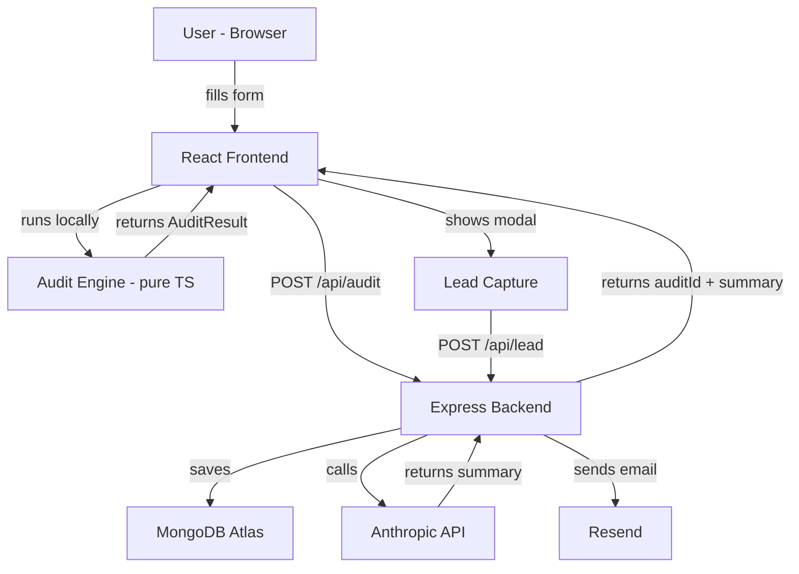

# Architecture

## System Diagram

## Data Flow
1. User fills form → saved to localStorage
2. On submit → auditEngine.ts runs pure TS rules → returns AuditResult
3. Results page loads → POST to /api/audit → saved to MongoDB → Anthropic generates summary
4. Unique audit ID returned → used for shareable URL /audit/:id
5. After 4 seconds → lead modal shown → email saved to MongoDB

## Stack Choice
- **React + TypeScript** — Type safety across the audit engine prevents logic bugs
- **Express + Node** — Lightweight, fast API, same language as frontend
- **MongoDB** — Flexible schema for audit documents with variable tool arrays
- **Anthropic API** — Best-in-class for structured narrative generation

## Scaling to 10k audits/day
- Add Redis cache for audit results by ID
- Move Anthropic calls to a queue (BullMQ)
- Add CDN for frontend assets
- MongoDB Atlas auto-scales horizontally